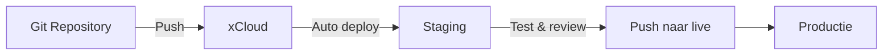

## Overzicht

xCloud ondersteunt Git-based deployments waarmee je code direct vanuit een repository kunt deployen naar je server. Dit maakt het mogelijk om een professionele deployment workflow op te zetten zonder handmatig bestanden te uploaden.



---

## Git provider koppelen

<Steps>
  <Step title="Git integratie openen" icon="git-branch">
    Ga in het xCloud dashboard naar **Settings > Git Integration** en selecteer je Git provider.
  </Step>
  <Step title="Account autoriseren" icon="link">
    Autoriseer xCloud om toegang te krijgen tot je Git repositories. Na succesvolle autorisatie zijn al je repositories zichtbaar in het xCloud dashboard.

    | Provider | Ondersteund |
    |----------|------------|
    | **GitHub** | Ja |
    | **GitLab** | Ja |
    | **Bitbucket** | Ja |
  </Step>
  <Step title="Repository selecteren" icon="folder">
    Selecteer de repository die je wilt koppelen aan je site. Kies de juiste branch (bijv. `main` of `production`).
  </Step>
</Steps>

---

## Site deployen vanuit Git

### Nieuwe site vanuit repository

Bij het aanmaken van een nieuwe site kun je **Clone from Git Repository** kiezen. xCloud kloont de repository en installeert WordPress op basis van de code.

<Callout kind="info" title="Alleen WordPress">
  Klonen vanuit Git wordt momenteel alleen ondersteund voor WordPress sites. De repository moet een compleet WordPress thema of volledige installatie bevatten.
</Callout>

### Deployment bij push

Configureer automatische deployments zodat elke push naar de gekoppelde branch een deployment triggert:

1. Ga naar **Site > Deployment Settings**
2. Activeer **Auto Deploy on Push**
3. Selecteer de branch die je wilt monitoren

---

## Deployment workflow

### Aanbevolen workflow

<Steps>
  <Step title="Lokaal ontwikkelen" icon="code">
    Ontwikkel features en fixes lokaal. Gebruik een lokale WordPress omgeving (bijv. Local by Flywheel of MAMP).
  </Step>
  <Step title="Push naar Git" icon="upload">
    Commit en push je wijzigingen naar de repository:

    ```bash
    git add .
    git commit -m "feat: nieuwe functionaliteit"
    git push origin main
    ```
  </Step>
  <Step title="Automatische deployment" icon="zap">
    xCloud detecteert de push en deployt automatisch naar de staging omgeving (indien geconfigureerd).
  </Step>
  <Step title="Testen op staging" icon="search">
    Test de wijzigingen op de staging omgeving. Controleer functionaliteit, styling en performance.
  </Step>
  <Step title="Push naar productie" icon="check-circle">
    Ga naar **Site > Staging** en klik op **Push to Live** om de geteste wijzigingen naar productie te deployen.
  </Step>
</Steps>

---

## Deployment logs

Alle deployments worden gelogd in het xCloud dashboard onder **Site > Deployment Logs**. Hier kun je zien:

- **Tijdstip** van elke deployment
- **Status** (geslaagd of mislukt)
- **Branch en commit** die is gedeployed
- **Push/pull records** voor staging acties

---

## Handmatige deployment

Naast Git-based deployments kun je ook handmatig deployen:

| Methode | Wanneer gebruiken |
|---------|------------------|
| **SFTP** | Snelle losse bestanden uploaden |
| **File Manager** | Bestanden beheren via het xCloud dashboard |
| **WP CLI** | WordPress beheer via command line |

<Callout kind="tip" title="WP CLI">
  xCloud biedt SSH toegang waarmee je WP CLI commando's kunt uitvoeren. Handig voor database exports, plugin updates en cache management.
</Callout>

---

## Best practices

- Deploy altijd eerst naar **staging** en test voordat je naar productie pusht
- Gebruik **duidelijke commit messages** zodat deployment logs leesbaar zijn
- Zet **auto deploy** alleen aan op de staging branch, niet direct op productie
- Maak een **backup** voordat je grote wijzigingen naar productie pusht
- Houd de repository **schoon** — commit geen `node_modules/`, uploads of `.env` bestanden

---

## Gerelateerd

<Columns cols={3}>
  <Card title="Server Setup" icon="server" href="/hosting/server-setup">
    Hetzner server opzetten via xCloud.
  </Card>
  <Card title="Site Management" icon="globe" href="/hosting/site-management">
    Sites aanmaken, domeinen en SSL.
  </Card>
  <Card title="Backups & Security" icon="shield" href="/hosting/backups-security">
    Backup configuratie en beveiligingsinstellingen.
  </Card>
</Columns>
