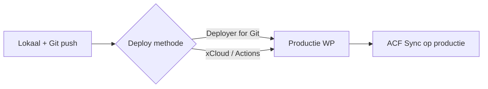

## Overzicht

Code gaat naar productie via Git — niet via handmatige (S)FTP-uploads. In de praktijk gebruik je vaak een van deze routes:

| Methode | Wanneer |
|---------|---------|
| **Deployer for Git** (WordPress-plugin) | Meest gebruikt: theme/repo bijwerken op productie, handmatig of via webhook |
| **xCloud Git deployment** | Site gekoppeld aan Git in het xCloud dashboard (auto deploy / staging) |
| **GitHub Actions** | CI/CD met build + rsync — zie [Deployment](/devops/deployment) en [CI/CD Setup](/devops/ci-cd) |


```mermaid
graph LR
    A["Lokaal + Git push"] --> B{"Deploy methode"}
    B -->|"Deployer for Git"| C["Productie WP"]
    B -->|"xCloud / Actions"| C
    C --> D["ACF Sync op productie"]
```

---

## Deployer for Git (vaak gebruikt)

De plugin **Deployer for Git** draait in WordPress op de productiesite en synchroniseert de gekoppelde Git-repository (meestal het theme) naar de server.

### Handmatig of via webhook

| Trigger | Hoe |
|---------|-----|
| **Handmatig** | In WP-admin de plugin openen en deploy/pull starten wanneer je klaar bent |
| **Webhook** | Repository-webhook koppelen zodat een push naar de gekozen branch automatisch de code op productie bijwerkt |

<Steps>
  <Step title="Plugin installeren en koppelen" icon="plug">
    Installeer **Deployer for Git** op de productiesite. Koppel de Git-repository en kies de branch (meestal `main`).
  </Step>
  <Step title="Kies handmatig of webhook" icon="git-branch">
    - **Handmatig:** deploy alleen starten als je bewust wilt live gaan.
    - **Webhook:** configureer de webhook in GitHub/GitLab zodat pushes automatisch worden opgehaald.
  </Step>
  <Step title="Deploy uitvoeren" icon="upload">
    Push je commits (bij webhook) of start de sync in de plugin (handmatig). Controleer of de bestanden op productie zijn bijgewerkt.
  </Step>
  <Step title="ACF veldgroepen syncen" icon="database">
    Na elke deploy met ACF-wijzigingen: ga op de **productiesite** naar **ACF > Sync** en synchroniseer alle veldgroepen met "Sync beschikbaar".

    <Callout kind="warning" title="Niet vergeten">
      De JSON-bestanden staan wel op de server na een Git-deploy, maar ACF past ze pas toe nadat je in de productie-admin synchroniseert. Zonder deze stap missen nieuwe of gewijzigde velden op live.
    </Callout>
  </Step>
  <Step title="Controleer de live site" icon="check-circle">
    Check styling, nieuwe blokken, formulieren en of pagebuilder-layouts kloppen.
  </Step>
</Steps>

---

## xCloud Git deployments

xCloud ondersteunt ook Git-based deployments vanuit het dashboard — handig als de site daar al aan Git is gekoppeld.

### Git provider koppelen

<Steps>
  <Step title="Git integratie openen" icon="git-branch">
    Ga in het xCloud dashboard naar **Settings > Git Integration** en selecteer je Git provider.
  </Step>
  <Step title="Account autoriseren" icon="link">
    Autoriseer xCloud om toegang te krijgen tot je repositories.

    | Provider | Ondersteund |
    |----------|------------|
    | **GitHub** | Ja |
    | **GitLab** | Ja |
    | **Bitbucket** | Ja |
  </Step>
  <Step title="Repository selecteren" icon="folder">
    Selecteer de repository en branch (bijv. `main` of `production`).
  </Step>
</Steps>

### Deployment bij push (xCloud)

1. Ga naar **Site > Deployment Settings**
2. Activeer **Auto Deploy on Push**
3. Selecteer de branch die je wilt monitoren

Ook hierna: bij ACF-wijzigingen **ACF > Sync** op productie uitvoeren.

---

## Aanbevolen workflow

<Steps>
  <Step title="Lokaal ontwikkelen" icon="code">
    Werk lokaal op `projectnaam.local`. Build assets met `npm run build` voordat je commit.
  </Step>
  <Step title="Push naar Git" icon="upload">
    ```bash
    git add .
    git commit -m "feat: nieuwe functionaliteit"
    git push origin main
    ```
  </Step>
  <Step title="Deploy naar productie" icon="zap">
    Via **Deployer for Git** (handmatig of webhook) of via xCloud / GitHub Actions, afhankelijk van het project.
  </Step>
  <Step title="ACF syncen op productie" icon="database">
    Synchroniseer veldgroepen in de productie-admin als er ACF-JSON is gewijzigd.
  </Step>
  <Step title="Testen op live" icon="search">
    Controleer functionaliteit, styling en performance. Gebruik staging waar die beschikbaar is.
  </Step>
</Steps>

---

## Deployment logs

Bij xCloud vind je logs onder **Site > Deployment Logs** (tijdstip, status, branch/commit). Bij Deployer for Git controleer je de status in de plugin zelf en eventueel de webhook-delivery in GitHub/GitLab.

---

## Andere methodes (uitzondering)

| Methode | Wanneer gebruiken |
|---------|------------------|
| **SFTP / File Manager** | Alleen spoedfixes of losse bestanden — niet de standaard deployroute |
| **WP CLI** | Database, plugins, cache — niet als vervanging van theme-deploys |

<Callout kind="tip" title="WP CLI">
  xCloud biedt SSH-toegang voor WP CLI (exports, plugin updates, cache). Theme-code blijft via Git + Deployer/xCloud gaan.
</Callout>

---

## Best practices

- Gebruik **Deployer for Git** of een andere Git-route; vermijd structurele (S)FTP-deploys
- **Sync ACF op productie** na deploys met veldgroepwijzigingen
- Gebruik **duidelijke commit messages**
- Maak een **backup** vóór grote productiewijzigingen
- Commit geen `node_modules/`, uploads of secrets

---

## Gerelateerd

<Columns cols={3}>
  <Card title="Deployment (DevOps)" icon="upload" href="/devops/deployment">
    Overzicht van GitHub Actions vs Deployer for Git.
  </Card>
  <Card title="Site Management" icon="globe" href="/hosting/site-management">
    Sites aanmaken, domeinen en SSL.
  </Card>
  <Card title="Backups & Security" icon="shield" href="/hosting/backups-security">
    Backup configuratie en beveiliging.
  </Card>
</Columns>
