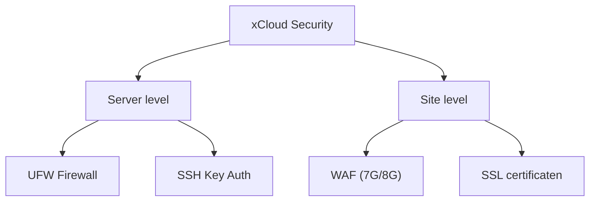

## Overzicht

Security op server- én site-niveau in xCloud, aangevuld met [WP Defender](/wordpress/plugins/wp-defender) in WordPress.

---

## Firewall

### UFW Firewall

xCloud configureert automatisch een **UFW** op je server. Via het dashboard kun je regels bekijken, toevoegen of uitschakelen.

Standaardpoorten: **22** (SSH), **80** (HTTP), **443** (HTTPS).

### Web Application Firewall (WAF)

| Bescherming tegen | WAF regel |
|-------------------|-----------|
| SQL injection | 7G + 8G |
| Cross-site scripting (XSS) | 7G + 8G |
| Bad bots en scrapers | 7G + 8G |
| File inclusion attacks | 7G + 8G |
| Directory traversal | 7G + 8G |

Ga naar **Site > Security** en activeer bij voorkeur de **8G** firewall. Whitelist legitieme requests via **Site > Security > WAF Rules** indien nodig.

<Callout kind="info" title="NGINX vereist">
  WAF regel customization (7G/8G whitelist) is momenteel alleen beschikbaar voor NGINX servers.
</Callout>

---

## SSL & SSH

| Onderdeel | Standaard |
|-----------|-----------|
| SSL | Let's Encrypt + HTTPS aan — zie [Site Management](/hosting/site-management) |
| Root SSH via key | Ingeschakeld |
| Root SSH via wachtwoord | Uitgeschakeld |
| SSH poort | 22 |

Beheer keys via **Server > SSH Keys**.

---

## Security checklist

| Check | Beschrijving |
|-------|-------------|
| Remote backups actief | Zie [Backups](/hosting/backups) |
| WAF ingeschakeld | 7G of 8G actief |
| SSL actief | HTTPS voor alle sites |
| SSH keys | Alleen geautoriseerde keys |
| PHP versie actueel | Stabiele 8.x |
| WordPress updates | Core, thema's, plugins |
| Ongebruikte plugins | Verwijderd |
| Database prefix | Geen standaard `wp_` |
| Admin URL | Altijd **`/beheer`** via [Defender](/wordpress/plugins/wp-defender) |

## Gerelateerd

- [Caching](/hosting/caching)
- [Backups](/hosting/backups)
- [WP Defender](/wordpress/plugins/wp-defender)
- [Server Setup](/hosting/server-setup)
