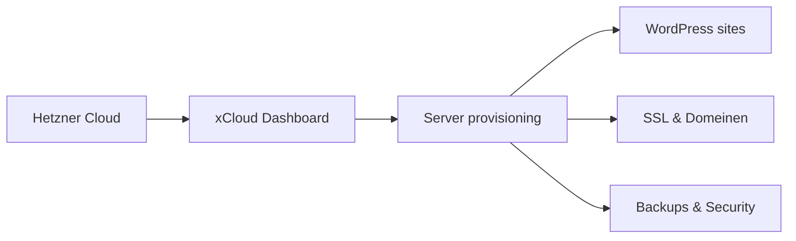

## Overzicht

Servers worden beheerd via [xCloud](https://xcloud.host), een managed hosting platform voor WordPress, Laravel en PHP applicaties. xCloud fungeert als controlepaneel bovenop je eigen cloud provider — in ons geval **Hetzner**. Je behoudt volledige controle over je server terwijl xCloud het beheer vereenvoudigt.



---

## Vereisten

| Vereiste | Beschrijving |
|----------|-------------|
| Hetzner account | Cloud Console account op [console.hetzner.cloud](https://console.hetzner.cloud) |
| Hetzner API token | Read & Write token voor xCloud koppeling |
| xCloud account | Dashboard account op [app.xcloud.host](https://app.xcloud.host) |

---

## Hetzner API token aanmaken

<Steps>
  <Step title="Hetzner Cloud Console openen" icon="globe">
    Log in op [console.hetzner.cloud](https://console.hetzner.cloud) en selecteer het project waarvoor je de server wilt aanmaken.
  </Step>
  <Step title="API token genereren" icon="key">
    Navigeer naar **Security > API tokens** in de linkerzijbalk. Klik op **Generate API token**, geef een beschrijving op (bijv. `xCloud`) en selecteer de permissie **Read & Write**.
  </Step>
  <Step title="Token kopiëren" icon="clipboard">
    Kopieer het gegenereerde token direct — het wordt maar één keer getoond. Bewaar het veilig.
  </Step>
</Steps>

<Callout kind="warning" title="Token veiligheid">
  Deel je API token nooit en sla het niet op in versiebeheer. Gebruik een wachtwoordmanager voor veilige opslag.
</Callout>

---

## Server aanmaken in xCloud

<Steps>
  <Step title="Nieuwe server toevoegen" icon="plus">
    Ga naar het xCloud dashboard en klik op **Add New Server**. Selecteer **Hetzner** als server provider.
  </Step>
  <Step title="API token invoeren" icon="link">
    Plak het Hetzner API token dat je eerder hebt aangemaakt. xCloud verifieert de verbinding automatisch.
  </Step>
  <Step title="Server configuratie" icon="settings">
    Kies de server specificaties:

    | Instelling | Aanbevolen |
    |-----------|------------|
    | **Locatie** | Falkenstein (EU) of Nuremberg (EU) |
    | **Server type** | CX22 of hoger (afhankelijk van verwacht verkeer) |
    | **OS** | Ubuntu (automatisch geselecteerd door xCloud) |
    | **Web server** | NGINX (aanbevolen) of OpenLiteSpeed |
  </Step>
  <Step title="Provisioning afwachten" icon="clock">
    Na het insturen duurt het **10-15 minuten** voordat de server live is. xCloud installeert automatisch NGINX/OLS, PHP, MySQL, Redis en SSL.
  </Step>
</Steps>

---

## Wat wordt er geïnstalleerd

xCloud installeert automatisch de volgende software op je server:

| Software | Beschrijving |
|----------|-------------|
| **NGINX** of **OpenLiteSpeed** | Web server |
| **PHP 8.x** | Meerdere versies beschikbaar, per site instelbaar |
| **MySQL 8.0** of **MariaDB** | Database server |
| **Redis** | Object caching |
| **Node.js** | Voor build tools en scripts |
| **Let's Encrypt** | Gratis SSL certificaten |
| **UFW Firewall** | Uncomplicated Firewall met standaard regels |

---

## Firewall configuratie

xCloud voegt automatisch een firewall toe aan je Hetzner server met drie standaard poorten.

<Callout kind="warning" title="Firewall niet verwijderen">
  Verwijder de automatisch aangemaakte firewall regels niet. Deze beschermen je server tegen ongeautoriseerde toegang.
</Callout>

### Standaard poorten

| Poort | Protocol | Beschrijving |
|-------|----------|-------------|
| 22 | SSH | Secure Shell toegang |
| 80 | HTTP | Web verkeer |
| 443 | HTTPS | Beveiligd web verkeer |

Extra firewall regels kunnen worden beheerd via het xCloud dashboard onder **Server > Firewall Management**. Je kunt regels toevoegen, verwijderen of uitschakelen.

---

## SSH toegang

xCloud configureert SSH key authenticatie standaard. De root gebruiker is beperkt tot beveiligde SSH-toegang.

```bash
# Verbinden met je server
ssh root@jouw-server-ip

# Of via specifieke SSH key
ssh -i ~/.ssh/jouw_key root@jouw-server-ip
```

<Callout kind="tip" title="SSH keys">
  SSH key authenticatie is veiliger dan wachtwoord-authenticatie. Voeg je publieke SSH key toe via het xCloud dashboard onder **Server > SSH Keys**.
</Callout>

---

## Server monitoring

Via het xCloud dashboard kun je de server status monitoren:

- **CPU & geheugen** gebruik
- **Schijfruimte** overzicht
- **Actieve sites** op de server
- **Service status** (NGINX, PHP, MySQL, Redis)

---

## Volgende stappen

<Columns cols={3}>
  <Card title="Site Management" icon="globe" href="/hosting/site-management">
    WordPress site aanmaken en configureren.
  </Card>
  <Card title="Deployments" icon="git-branch" href="/hosting/deployments">
    Git integratie en deployment workflow.
  </Card>
  <Card title="Backups & Security" icon="shield" href="/hosting/backups-security">
    Backup configuratie en beveiligingsinstellingen.
  </Card>
</Columns>
