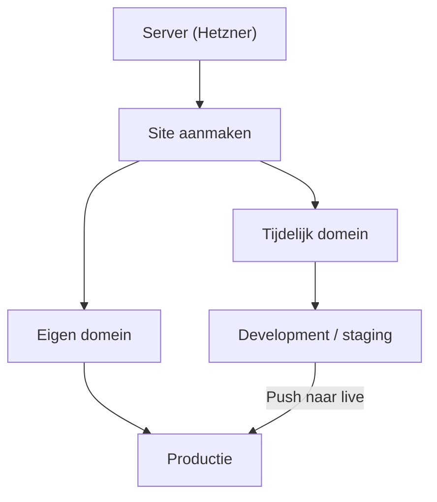

## Overzicht

Na het opzetten van een server kun je via xCloud WordPress sites aanmaken en beheren. Elke site krijgt een eigen domein, SSL certificaat en kan worden voorzien van een staging omgeving.

---

## WordPress site aanmaken

<Steps>
  <Step title="Nieuwe site toevoegen" icon="plus">
    Ga naar je server in het xCloud dashboard en klik op **Create New Site**. Selecteer **WordPress** als site type.
  </Step>
  <Step title="Site details invullen" icon="edit-3">
    Vul de volgende gegevens in:

    | Veld | Beschrijving |
    |------|-------------|
    | **Site naam** | Herkenbare naam voor in het dashboard |
    | **Domein** | Je eigen domein of een tijdelijk xCloud domein |
    | **PHP versie** | PHP 8.1 of hoger (aanbevolen: 8.2+) |
    | **Omgeving** | Production of Staging |
  </Step>
  <Step title="WordPress installatie" icon="zap">
    xCloud installeert WordPress automatisch. Dit duurt **1-2 minuten**. Na installatie kun je direct inloggen in de WordPress admin.
  </Step>
</Steps>

<Callout kind="tip" title="Tijdelijk domein">
  Als je je domein nog niet wilt koppelen, biedt xCloud een tijdelijk staging domein aan. Dit is handig tijdens development — later kun je eenvoudig je eigen domein toevoegen.
</Callout>

---

## Domein koppelen

xCloud beheert geen DNS. Je moet zelf een **A record** toevoegen bij je DNS provider (bijv. Cloudflare, TransIP).

<Steps>
  <Step title="Server IP opzoeken" icon="server">
    Ga naar je server in het xCloud dashboard en kopieer het **IP-adres**.
  </Step>
  <Step title="DNS instellen" icon="globe">
    Voeg een A record toe bij je DNS provider:

    | Type | Naam | Waarde | TTL |
    |------|------|--------|-----|
    | A | `@` | `jouw-server-ip` | Auto |
    | A | `www` | `jouw-server-ip` | Auto |
  </Step>
  <Step title="Domein toevoegen in xCloud" icon="link">
    Ga naar **Site > Domain Management** en voeg je domein toe. xCloud configureert de webserver automatisch.
  </Step>
</Steps>

<Callout kind="info" title="DNS propagatie">
  Het kan tot 24 uur duren voordat DNS wijzigingen wereldwijd zijn doorgevoerd, maar meestal is dit binnen enkele minuten geregeld.
</Callout>

---

## SSL certificaat

xCloud biedt gratis SSL via **Let's Encrypt** met één klik activering.

### Gratis SSL activeren

Ga naar **Site > SSL** en zet de **HTTPS** toggle aan. xCloud genereert en installeert het certificaat automatisch, inclusief automatische verlenging.

### Custom SSL

Als je een eigen SSL certificaat hebt (bijv. van een betaalde CA), kun je dit handmatig uploaden via dezelfde SSL instellingen.

---

## Staging omgeving

Elke WordPress site kan een staging omgeving hebben voor het veilig testen van updates, plugins en design wijzigingen.

### Staging aanmaken

Maak een staging omgeving aan via **Site > Staging** in het xCloud dashboard. xCloud maakt een kopie van je live site.

### Push en Pull

| Actie | Beschrijving |
|-------|-------------|
| **Push** (staging → live) | Zet geteste wijzigingen door naar productie |
| **Pull** (live → staging) | Haal de laatste live data op naar staging |

<Callout kind="info" title="SEO bescherming">
  Indexering is standaard uitgeschakeld op staging sites om te voorkomen dat staging URL's worden geïndexeerd door zoekmachines.
</Callout>

Bij een push-actie maakt xCloud automatisch een backup, overschrijft de doelomgeving en leegt de cache.

---

## PHP versie

De PHP versie is per site instelbaar via **Site > PHP Version**. Beschikbare versies:

| Versie | Status |
|--------|--------|
| PHP 8.3 | Aanbevolen |
| PHP 8.2 | Stabiel |
| PHP 8.1 | Ondersteund |
| PHP 8.0 | End of life |

<Callout kind="tip">
  Gebruik altijd de nieuwste stabiele PHP versie voor betere performance en veiligheid. Test eerst op staging voordat je de PHP versie op productie wijzigt.
</Callout>

---

## E-mail configuratie

xCloud kan transactionele e-mails versturen via een SMTP provider. Dit wordt geconfigureerd via **FluentSMTP** (WordPress plugin).

### Ondersteunde SMTP providers

| Provider | Beschrijving |
|----------|-------------|
| **Mailgun** | Betrouwbaar voor transactionele e-mails |
| **SendGrid** | Populair voor bulk en transactionele e-mails |
| **Elastic Email** | Voordelig voor hoge volumes |
| **Elke SMTP provider** | Handmatige SMTP configuratie mogelijk |

<Callout kind="warning" title="E-mail testen">
  Configureer altijd een SMTP provider. Standaard server-mail is onbetrouwbaar en komt vaak in spam terecht.
</Callout>

---

## Gerelateerd

<Columns cols={3}>
  <Card title="Server Setup" icon="server" href="/hosting/server-setup">
    Hetzner server opzetten via xCloud.
  </Card>
  <Card title="Deployments" icon="git-branch" href="/hosting/deployments">
    Git integratie en deployment workflow.
  </Card>
  <Card title="Backups & Security" icon="shield" href="/hosting/backups-security">
    Backup configuratie en beveiligingsinstellingen.
  </Card>
</Columns>
