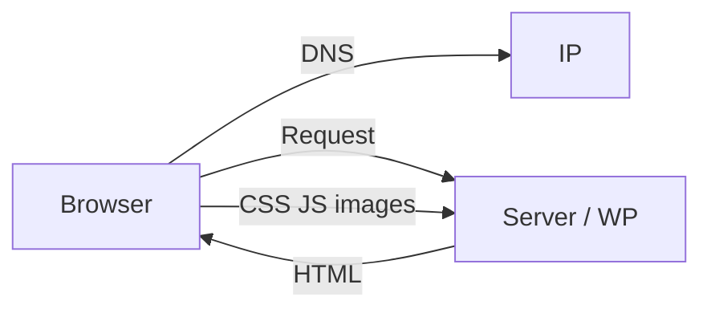

## In het kort

1. Je typt `https://voorbeeld.nl`  
2. **DNS** zoekt het IP van de server ([DNS-basis](/kennis/dns))  
3. Browser vraagt de **server** om de pagina (HTTP-request)  
4. Server (bij ons: NGINX + WordPress/PHP) stuurt **HTML** terug  
5. Browser ziet links naar **CSS** en **JS** → haalt die ook op  
6. Pagina wordt getekend; scripts kunnen nog content bijladen  

## Wat jij ziet in de praktijk

| Symptoom | Vaak oorzaak |
|----------|----------------|
| Styling “oud” na deploy | **Page cache** of browsercache — purge ([Caching](/hosting/caching)) |
| Werkt lokaal, live niet | Andere DB, cache, of assets niet gebuild (`npm run build`) |
| Formulier traag / faalt | JS-fout, cookie-consent, of SMTP — DevTools → Console / Network |

## DevTools (handig)

- **Console** — JavaScript-fouten  
- **Network** — welke bestanden laden (rood = mislukt)  
- **Hard refresh** — cache omzeilen (Cmd+Shift+R)  

## Af (begrip)

- [ ] Je snapt: HTML eerst, daarna CSS/JS  
- [ ] Je weet dat cache tussen jou en “verse” code kan zitten  
- [ ] Je kunt Console/Network openen bij een bug  

## Gerelateerd

- [DNS](/kennis/dns) · [Caching](/hosting/caching) · [Bestanden](/wordpress/bestanden)
