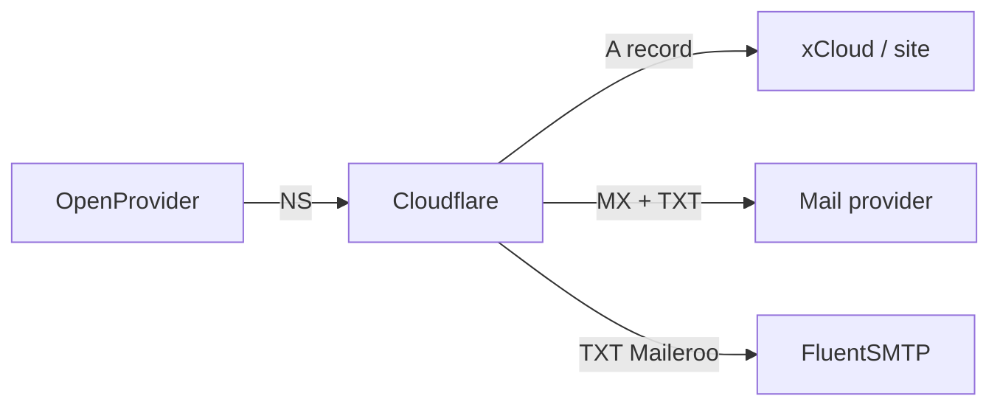

## Wat is DNS?

**DNS** (Domain Name System) koppelt een **domeinnaam** (`voorbeeld.nl`) aan diensten: website (IP), e-mail (MX), verificatie (TXT). Zonder juiste DNS laadt de site niet of komt mail niet aan.

Bij ons:

| Rol | Tool |
|-----|------|
| **DNS beheer** | [Cloudflare](/overig/cloudflare) |
| **Domein registreren / transfer** | [OpenProvider](/overig/openprovider) |

Registrar ≠ DNS: OpenProvider kan het domein “bezitten”; de **nameservers** wijzen meestal naar Cloudflare, daar staan de records.

---

## Nameservers

Nameservers vertellen de wereld: “vraag DNS-records aan bij deze partij.”

- Cloudflare geeft 2 NS (bijv. `xxx.ns.cloudflare.com`)
- Die zet je bij de registrar
- Zone in Cloudflare moet **Active** zijn voordat je op DNS vertrouwt

Zie [Cloudflare — Domein toevoegen](/overig/cloudflare) en bij overnames: **CF + NS eerst, transfer daarna** ([Livegang](/sops/livegang/productie-en-dns)).

---

## Veelvoorkomende records

| Type | Voorbeeldnaam | Doel |
|------|---------------|------|
| **A** | `@` of `projectnaam` | IPv4-adres → webserver (xCloud) |
| **AAAA** | `@` | IPv6 (als de server dat heeft) |
| **CNAME** | `www` | Alias naar een andere hostnaam |
| **MX** | `@` | Mailservers (Google, M365, MXRoute, …) |
| **TXT** | `@` of subhost | SPF, DKIM, DMARC, domeinverificatie |
| **NS** | `@` | Wie de zone beheert (meestal via registrar, niet als losse records in CF bewerken tenzij je weet wat je doet) |

### Proxy in Cloudflare

- **DNS only** (grijs): verkeer gaat direct naar het IP — standaard bij ons + Let's Encrypt op de server  
- **Proxied** (oranje): verkeer via Cloudflare — alleen bewust gebruiken  

Voor `*.kayjilesen.dev` en typische WP-sites: **DNS only**. Zie [Staging](/sops/staging/site-en-deploy).

---

## E-mail: SPF, DKIM, DMARC

Drie TXT-gerelateerde mechanismen die bepalen of mail **legitiem** lijkt:

| Mechanisme | Wat het doet |
|------------|----------------|
| **SPF** | Welke servers mogen mail sturen *namens* dit domein |
| **DKIM** | Digitale handtekening op berichten (key in DNS) |
| **DMARC** | Beleid: wat als SPF/DKIM faalt + rapportage |

### SPF — belangrijke regel

Er mag **één** SPF-record (`TXT` op `@` die met `v=spf1` begint) zijn. Meerdere SPF-TXT’s = gebroken mail.

Combineer includes in **één** regel, bijv. Google **én** Maileroo (transactionele site-mail):

```text
v=spf1 include:_spf.google.com include:spf.maileroo.com ~all
```

(Exacte includes volgens de provider — dit is het idee.)

Site-mail (FluentSMTP / Maileroo): [FluentSMTP](/wordpress/plugins/fluent-smtp).  
Klantmailboxen (M365 / Google): [Email](/email/microsoft-365) onder Overig.

### DKIM

Provider geeft een **CNAME** of **TXT** (vaak op iets als `google._domainkey` of Maileroo-host). Zonder DKIM meer spam-risico.

### DMARC

Meestal TXT op `_dmarc`:

```text
v=DMARC1; p=quarantine; rua=mailto:jij@kayjilesen.nl
```

Start mild (`p=none` of `quarantine`); streng (`reject`) pas als SPF/DKIM stabiel zijn.

---

## Praktijk bij ons



1. Zone in Cloudflare  
2. A → server-IP (DNS only)  
3. MX/TXT voor mailboxen  
4. Extra TXT/CNAME voor Maileroo / SES-verificatie waar nodig  
5. SSL in xCloud nádat DNS resolve’t  

---

## Af (begrip / check)

- [ ] Je kunt uitleggen: registrar vs DNS vs hosting  
- [ ] Je herkent A, CNAME, MX, TXT  
- [ ] Je weet: SPF = één record; proxy grijs bij standaard WP  
- [ ] Je weet waar CF- en OpenProvider-docs staan  

## Gerelateerd

- [Cloudflare](/overig/cloudflare) · [OpenProvider](/overig/openprovider)  
- [FluentSMTP](/wordpress/plugins/fluent-smtp) · [Klant-e-mail SOP](/sops/extra/klant-email)
