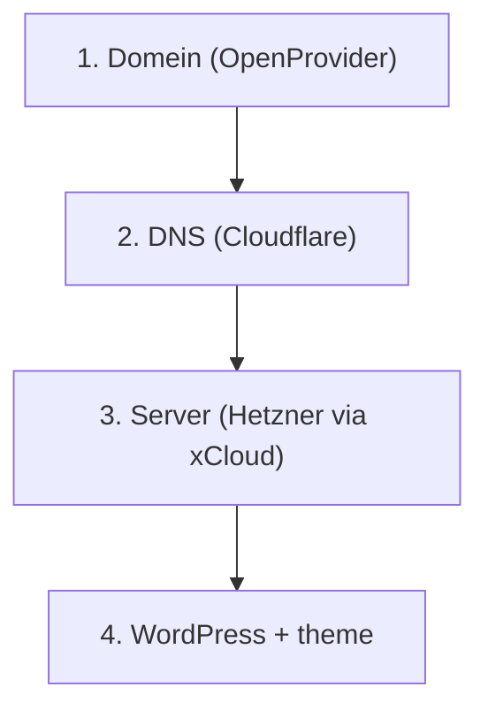

## De lagen

| Laag | Wat | Bij ons |
|------|-----|---------|
| **1. Domein** | Naam is van iemand; verlenging/factuur | [OpenProvider](/overig/openprovider) |
| **2. DNS** | Waar wijst de naam heen? | [Cloudflare](/overig/cloudflare) · [DNS-basis](/kennis/dns) |
| **3. Server** | Machine + PHP/MySQL/NGINX | [xCloud](/hosting/server-setup) / Hetzner |
| **4. Site** | WP, theme, plugins, content | Git-deploy, [SOP's](/sops/overzicht) |

## Staging vs live

- Staging-URL: `projectnaam.kayjilesen.dev` (A-record in zone `kayjilesen.dev`)  
- Live: klant-domein, zelfde xCloud-site omzetten  

Zie [Staging](/sops/staging/site-en-deploy) · [Livegang](/sops/livegang/productie-en-dns).

## Lokaal

Daaronder nog een laag: **jouw Mac + MAMP** (`.local`) — niet op het publieke internet. [Lokaal](/sops/lokaal/omgeving).

## Af (begrip)

- [ ] Je kunt de vier lagen noemen  
- [ ] Je snapt: DNS-fout ≠ theme-bug  
- [ ] Je weet waar staging vs live zit  

## Gerelateerd

- [DNS](/kennis/dns) · [Site Management](/hosting/site-management) · [SOP Overzicht](/sops/overzicht)
