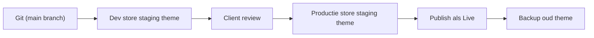

## Overzicht

Shopify heeft geen traditionele build/deploy pipeline — je uploadt het theme direct via de CLI. Onze aanpak: **Git is de bron van waarheid**, dev store is staging, en je pushed pas naar de productie-store wanneer de klant akkoord is.

<Callout kind="info" title="Theme slots">
  Een Shopify store heeft maximaal 20 themes tegelijk. Eén is **Live** (wat bezoekers zien), de rest zijn **unpublished**. We gebruiken unpublished slots voor staging en QA.
</Callout>

## Workflow Diagram



## Stappen

<Steps>
  <Step title="Theme pushen naar dev store" icon="upload">
    Tijdens development push je regelmatig naar een unpublished theme in je dev store:

    ```bash
    shopify theme push --unpublished --theme "Staging"
    ```

    De eerste keer maakt dit een nieuw theme aan. Daarna update je hetzelfde theme:

    ```bash
    shopify theme push --theme <theme-id>
    ```

    Vind het theme ID via `shopify theme list`.
  </Step>

  <Step title="Preview URL delen" icon="eye">
    Genereer een shareable preview URL voor de klant:

    ```bash
    shopify theme share --theme <theme-id>
    ```

    De klant kan de site bekijken zonder dat het live staat. Deze URL blijft werken zolang het theme bestaat.
  </Step>

  <Step title="Collaborator access regelen" icon="users">
    Om naar de productie-store van de klant te pushen, vraag je **collaborator access** aan vanuit het Partners dashboard:

    1. Partners dashboard → Stores → Add store → **Manage a client's store**
    2. Vul het `.myshopify.com` domein van de klant in
    3. Shopify stuurt een request naar de store owner
    4. Zodra de klant akkoord gaat, verschijnt de store in je dashboard

    <Callout kind="tip">
      Collaborator access is gratis en telt niet mee voor de user limit van het Shopify plan. Vraag altijd alleen de permissions aan die je echt nodig hebt (Themes + eventueel Apps).
    </Callout>
  </Step>

  <Step title="Pullen van productie-store" icon="download">
    **Altijd** eerst de huidige productie-theme pullen voordat je nieuwe content pusht — de klant kan settings hebben aangepast in de editor die niet in Git staan:

    ```bash
    shopify theme pull --live --store klant.myshopify.com --path ./production-backup
    ```

    Vergelijk met je Git branch. Merge settings die de klant heeft gewijzigd (meestal in `config/settings_data.json` en JSON templates) in je codebase.
  </Step>

  <Step title="Staging theme uploaden naar productie-store" icon="upload-cloud">
    Push je theme als **unpublished** naar de productie-store:

    ```bash
    shopify theme push --unpublished --theme "Nieuw theme - v1.0" --store klant.myshopify.com
    ```

    Deel een preview URL voor een laatste QA ronde met de klant.
  </Step>

  <Step title="Live publiceren" icon="check-circle">
    Pas als alles akkoord is, publiceer je het theme:

    ```bash
    shopify theme publish --theme <theme-id> --store klant.myshopify.com
    ```

    Of handmatig via Shopify admin: **Online Store → Themes → Actions → Publish**.

    <Callout kind="warning">
      Publiceren is instant — bezoekers zien het nieuwe theme direct. Doe dit buiten piekuren en plan rollback (vorige theme blijft in de unpublished lijst staan).
    </Callout>
  </Step>

  <Step title="Oude theme archiveren" icon="archive">
    Hernoem het vorige live theme naar `Archive - v0.9 - YYYY-MM-DD` zodat het duidelijk is welke versie er stond. Verwijder nooit direct — pas na minimaal 30 dagen stabiele productie.
  </Step>
</Steps>

## Rollback Procedure

Als er na publiceren een kritieke bug opduikt:

1. Ga naar **Online Store → Themes** in Shopify admin
2. Vind het vorige `Archive` theme
3. Klik **Actions → Publish**
4. Done — instant rollback, geen deploy nodig

Bugfix daarna in Git, push nieuwe versie, QA, republish.

## Settings Data Sync

Het grootste deployment-risico: `config/settings_data.json` en JSON templates verschillen tussen klant-store en Git omdat de klant via de editor content heeft bewerkt.

<Callout kind="warning" title="Overschrijf nooit blind settings_data.json">
  Bij elke deploy: pull de live theme eerst, merge handmatig de content-changes (images, teksten, section volgorde) van de klant in je branch, push daarna pas.
</Callout>

**Bestanden die de klant typisch wijzigt:**
- `config/settings_data.json` — theme-wide settings
- `templates/*.json` — per pagina sections en volgorde
- `sections/header-group.json`, `sections/footer-group.json` — section groups

**Bestanden die jij controleert (code):**
- `sections/*.liquid`, `snippets/*.liquid`, `layout/*.liquid`
- `assets/*.css`, `assets/*.js`
- `config/settings_schema.json`
- `locales/*.json`

## Deployment Checklist

- [ ] Productie theme gepulled en gemerged
- [ ] `shopify theme check` geeft geen errors
- [ ] Preview URL getest op desktop + mobile
- [ ] Checkout flow getest met test order
- [ ] Analytics/Pixels/GTM tags nog aanwezig
- [ ] Locales compleet (NL + EN minimaal)
- [ ] Favicon en social share images correct
- [ ] 404 en search templates werken
- [ ] Vorige theme behouden als backup
- [ ] Klant heeft final akkoord gegeven

## Gerelateerd

<Columns cols={2}>
  <Card title="Basis Setup" icon="rocket" href="/shopify/basis-setup">
    Partners account en dev store.
  </Card>
  <Card title="Sections & Blocks" icon="layers" href="/shopify/sections-blocks">
    Modulaire content bouwen.
  </Card>
</Columns>
