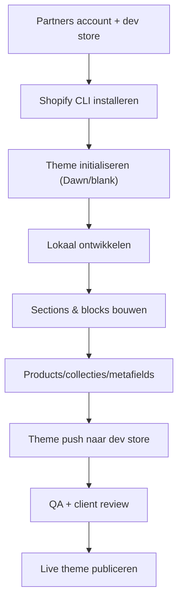

## Overzicht

Bij het bouwen van een **custom Shopify shop** werken we met een eigen theme (gebaseerd op Dawn of from scratch), de Shopify CLI voor lokale ontwikkeling, en Git voor versiebeheer. Dit document geeft een hoog-over beeld van de volledige workflow.

<Callout kind="info" title="Wanneer Shopify?">
  Shopify is de standaardkeuze voor e-commerce projecten waar snelheid, betrouwbaarheid en ingebouwde betaal/verzend-integraties zwaarder wegen dan volledige maatwerk-vrijheid. Voor complex maatwerk zonder webshop kiezen we WordPress.
</Callout>

## Workflow Diagram

## Stappen

<Steps>
  <Step title="Basis setup" icon="rocket">
    Partners account aanmaken, development store opzetten, Shopify CLI installeren. Zie [Basis Setup](/shopify/basis-setup).
  </Step>
  <Step title="Custom theme development" icon="code">
    Dawn forken of leeg theme starten, folderstructuur begrijpen, Liquid schrijven. Zie [Theme Development](/shopify/theme-development).
  </Step>
  <Step title="Sections & blocks" icon="layers">
    Modulaire sections maken met schema-gebaseerde settings zodat de klant zelf pagina's kan bouwen. Zie [Sections & Blocks](/shopify/sections-blocks).
  </Step>
  <Step title="Deployment" icon="upload">
    Theme pushen naar dev store, staging publiceren, live zetten. Zie [Deployment](/shopify/deployment).
  </Step>
</Steps>

## Tech Stack

| Onderdeel | Tool |
|-----------|------|
| Templating | Liquid |
| CLI | Shopify CLI (`shopify`) |
| Base theme | Dawn (fork) of blank |
| Styling | Theme CSS / Tailwind via build |
| Versiebeheer | Git (los van Shopify's theme history) |
| Hosting | Shopify (SaaS) |

## Gerelateerd

<Columns cols={2}>
  <Card title="Basis Setup" icon="rocket" href="/shopify/basis-setup">
    Partners account, dev store en CLI installeren.
  </Card>
  <Card title="Theme Development" icon="code" href="/shopify/theme-development">
    Custom theme bouwen op basis van Dawn.
  </Card>
  <Card title="Sections & Blocks" icon="layers" href="/shopify/sections-blocks">
    Modulaire content met Liquid schema's.
  </Card>
  <Card title="Deployment" icon="upload" href="/shopify/deployment">
    Theme pushen en live zetten.
  </Card>
</Columns>
