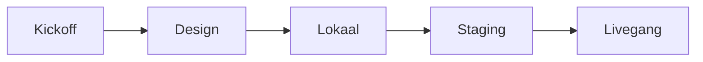

<Callout kind="info" title="Dit is de master-routekaart">
  Gebruik dit als overzicht. Details en Af-lijsten staan per subpagina. Sla geen fase over tenzij die aantoonbaar niet van toepassing is.
</Callout>

## Flow

| # | Fase | SOP's |
|---|------|--------|
| 1 | Kickoff | [Project starten](/sops/kickoff) |
| 2 | Design | [Merk & Figma](/sops/design/merk-en-figma) · [Structuur & content](/sops/design/structuur-en-content) · [Review & handoff](/sops/design/review-en-handoff) |
| 3 | Lokaal | [Omgeving](/sops/lokaal/omgeving) · [Theme / boilerplate](/sops/lokaal/theme-boilerplate) · [Bouwen](/sops/lokaal/bouwen) |
| 4 | Staging | [Site & deploy](/sops/staging/site-en-deploy) (`projectnaam.kayjilesen.dev`) · [Stack & testen](/sops/staging/stack-en-testen) · [Feedback](/sops/staging/feedback) |
| 5 | Livegang | [Productie & DNS](/sops/livegang/productie-en-dns) (staging omzetten) · [Go-live checks](/sops/livegang/go-live-checks) · [Oplevering](/sops/livegang/oplevering) |

**Indien in scope:** [Migratie](/sops/extra/migratie-wordpress) · [Klant-e-mail](/sops/extra/klant-email)

Daarna: [Doorlopend](/sops/doorlopend).

## Parallel vs volgorde

- **Design** en **lokale setup** mogen deels overlappen.
- **Bouwen** start als handoff genoeg is voor de eerste templates.
- **Staging** zo vroeg mogelijk na eerste deploy — stack (plugins, mail, cookies) niet pas bij livegang.
- **Livegang** = domeinwissel op dezelfde site; pas na go op staging-feedback.
- **Migratie / klant-e-mail** plannen in kickoff; uitvoeren parallel, cutover bij livegang.

## Klaar?

Alle Af-lijsten in Livegang → [Oplevering](/sops/livegang/oplevering) groen = site volgens standaard opgeleverd.
