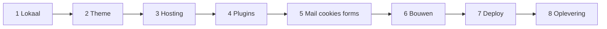

<Callout kind="info" title="Dit is een SOP">
  Volg de fases in volgorde. Elke fase heeft een detailpagina met stappen en een **Af**-checklist. Pas verder als de vorige fase af is.
</Callout>

## Doel

Een nieuwe klantsite staat lokaal én op productie volgens de KJ-standaard: theme uit boilerplate, plugins/presets, mail, cookies, formulieren, Git-deploy, en een afrondingscheck.

## Fases

### 1. Lokale omgeving

Volg [Lokale ontwikkelomgeving](/devops/local-dev).

**Af (fase 1)**

- [ ] Site bereikbaar op `projectnaam.local`
- [ ] Themamap bestaat: `/DEV/<project>/wp-content/themes/<project>/`
- [ ] Theme opgezet o.b.v. kj-boilerplate (Claude-prompt)
- [ ] `npm install` + `npm run dev` werkt
- [ ] Theme geactiveerd; ACF Pro aanwezig en JSON gesynct (lokaal)

### 2. Conventies kennen

Lees (geen checklist, wel verplicht vóór grote bouw):

- [Theme Architectuur](/wordpress/theme-architecture)
- [Naamgevingsconventies](/wordpress/naming-conventions)
- [ACF Patronen](/wordpress/acf-patterns)
- [KJ-Boilerplate](/client-projects/kj-boilerplate)

### 3. Hosting (xCloud)

Zie [Server Setup](/hosting/server-setup), [Site Management](/hosting/site-management), [Caching](/hosting/caching), [Backups](/hosting/backups), [Security](/hosting/security).

**Af (fase 3)**

- [ ] Productiesite in xCloud (domein + SSL)
- [ ] Page cache: FastCGI Nginx, 60 min
- [ ] Redis Object Cache aan
- [ ] Remote backup: incremental, full weekly, daily incr., retention 30 dagen
- [ ] WAF actief

### 4. Standaard plugins

Volg [Plugins overzicht](/wordpress/plugins/overzicht) en de individuele pluginpagina's.

**Af (fase 4)**

- [ ] Defender: login via **`/beheer`**
- [ ] Switchboard: standaardmodules aan
- [ ] Smush + Hummingbird presets / settings OK
- [ ] SureCookie geïmporteerd/geconfigureerd
- [ ] FluentSMTP: beide connections + Pushover

### 5. Mail, cookies, formulieren

- [FluentSMTP](/wordpress/plugins/fluent-smtp) — Maileroo primair, SES backup  
- [SureCookie](/wordpress/plugins/surecookie) — `wp_body_open`, beleidspagina, reconsent  
- [Formulieren](/wordpress/plugins/formulieren) — SureForms tenzij GF-feature nodig  

**Af (fase 5)**

- [ ] Testmail Maileroo én SES OK
- [ ] Pushover-test OK
- [ ] Cookiebanner zichtbaar (incognito); voorkeuren heropenbaar
- [ ] Formulier live getest; mail komt aan

### 6. Bouwen

Ontwikkel blocks/content volgens Figma en conventies. Dagelijks: `npm run dev`, commits via [Git Workflow](/devops/git-workflow).

**Af (fase 6)** — doorlopend / per milestone

- [ ] `npm run build` zonder errors vóór deploy
- [ ] ACF-JSON gecommit bij veldwijzigingen
- [ ] Geen secrets in Git

### 7. Deploy naar productie

Volg [Deployments](/hosting/deployments) (Deployer for Git).

**Af (fase 7)**

- [ ] Code op productie via Git/Deployer
- [ ] **ACF > Sync** gedaan indien JSON gewijzigd
- [ ] Page cache + Redis gepurged
- [ ] Steekproef pagina's/formulier/cookies op live

### 8. Oplevering

Volg [SOP: Oplevering](/sops/oplevering).

**Af (fase 8)** = volledige opleveringschecklist daar.

---

## Klaar?

Als fases 1–8 af zijn, is de site volgens standaard opgeleverd. Uitzonderingen (Gravity Forms, speciale plugins) alleen met bewuste reden — niet improviseren buiten deze SOP.
