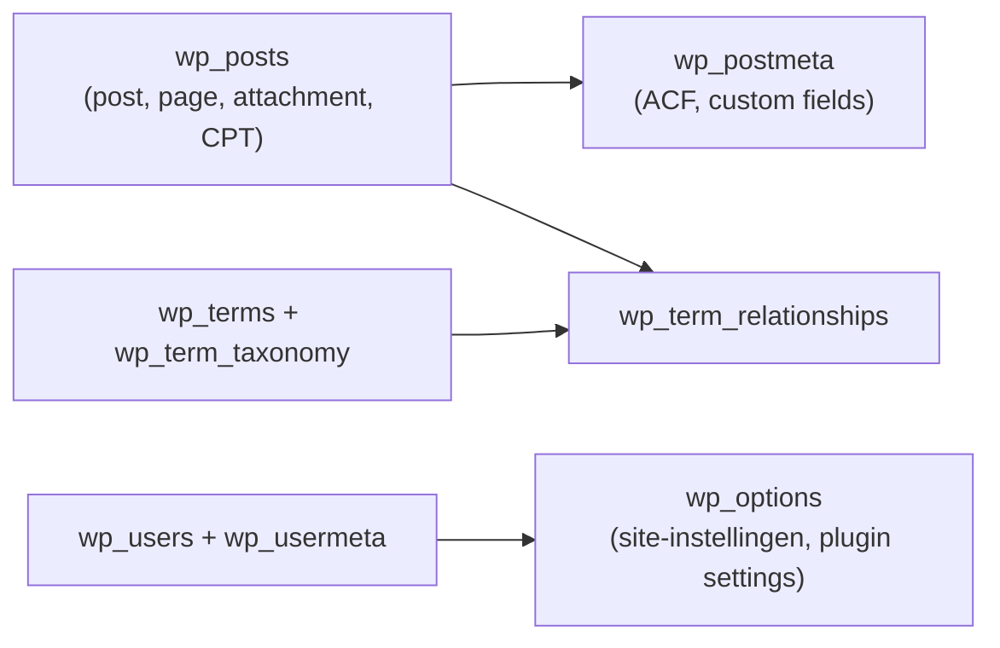

## Overzicht

WordPress bewaart content, gebruikers, instellingen en plugin-data in MySQL/MariaDB. Standaard prefix: **`wp_`** (op productie soms aangepast — check `wp-config.php`).

<Callout kind="info" title="Waarom dit kennen?">
  Bij migraties, broken media, ACF-problemen of “waar staat dit eigenlijk?” denk je eerst: **database**, **bestanden** (`wp-content`), of **config** (`wp-config.php`) — zie ook [Bestanden](/wordpress/bestanden) en [Configuratie](/wordpress/configuratie).
</Callout>

---

## Kernconcept: post = rij in `wp_posts`

Bijna alles is een “post” met een `post_type`:

| `post_type` | Wat het is | Admin |
|-------------|------------|--------|
| `post` | Blogbericht | Berichten |
| `page` | Pagina | Pagina’s |
| `attachment` | Media (afbeelding, PDF, …) | Media |
| `revision` | Revisie van een post/page | — |
| `nav_menu_item` | Menu-item | Weergave → Menu’s |
| Custom (bijv. `project`) | CPT uit het theme | Eigen menu |

Extra velden (ACF, SEO, custom) staan meestal **niet** in `wp_posts`, maar in **`wp_postmeta`**.



---

## Tabellen die je vaak tegenkomt

### Content & media

| Tabel | Inhoud | Praktisch |
|-------|--------|-----------|
| `wp_posts` | Titels, content, status, slug, parent, type | Pagina’s, posts, attachments, CPT’s |
| `wp_postmeta` | Key/value per post | ACF-velden, `_thumbnail_id`, plugin-meta |
| `wp_comments` | Reacties | Zelden op marketing-sites |
| `wp_commentmeta` | Meta bij comments | Idem |

### Taxonomieën

| Tabel | Inhoud |
|-------|--------|
| `wp_terms` | Namen & slugs (categorieën, tags, custom tax) |
| `wp_term_taxonomy` | Type (category/post_tag/…) + count |
| `wp_term_relationships` | Koppeling post ↔ term |
| `wp_termmeta` | Extra meta op terms |

### Gebruikers & site-instellingen

| Tabel | Inhoud | Praktisch |
|-------|--------|-----------|
| `wp_users` | Accounts | Login, e-mail |
| `wp_usermeta` | Rollen, voorkeuren | Capabilities |
| `wp_options` | Site-URL, actief theme, widgets, plugin settings | Autoload = performance-gevoelig |

### Multi-site (alleen als van toepassing)

| Tabel | Inhoud |
|-------|--------|
| `wp_blogs`, `wp_site`, `wp_sitemeta`, `wp_blogmeta` | Netwerk / sites |
| `wp_N_posts`, … | Per-site tabellen met site-ID in de naam |

De meeste KJ-sites zijn **single site** — negeer multi-site tenzij het project het expliciet gebruikt.

---

## Belangrijke `wp_options` keys

| Option name | Betekenis |
|-------------|-----------|
| `siteurl` | WordPress-adres (waar core staat) |
| `home` | Site-URL die bezoekers zien |
| `template` / `stylesheet` | Actief theme (mapnaam) |
| `active_plugins` | Lijst actieve plugins |
| `permalink_structure` | Permalink-instelling |
| `upload_path` / `upload_url_path` | Zelden custom; standaard leeg = `wp-content/uploads` |

<Callout kind="warning" title="URL’s na migratie">
  Verkeerde `home` / `siteurl` = redirects naar oude domeinen, broken admin, of assets die niet laden. Fix via WP-admin (Instellingen → Algemeen) of gecontroleerd in de database — niet half handmatig in content én options.
</Callout>

---

## ACF en de database

ACF slaat veld**waarden** op als postmeta (of termmeta / options, afhankelijk van de location).

| Waar | Voorbeeld |
|------|-----------|
| Veldwaarde op een pagina | `wp_postmeta` → key `hero_title`, value `Welkom` |
| Referentie naar velddefinitie | Vaak `_*` keys (bijv. `_hero_title` → field key) |
| Veld**groepen** (definitie) | Bij ons: JSON in het theme (`acf-json/`), niet als bron van waarheid in de DB |

<Callout kind="tip" title="JSON + Sync">
  Definitie leeft in Git (`acf-json/`). Op een omgeving: **ACF → Sync**. Zie [Werkwijze](/wordpress/acf-patterns).
</Callout>

---

## Media = database + bestanden

Een upload is **twee dingen**:

1. **Bestand** onder `wp-content/uploads/…` — zie [Bestanden](/wordpress/bestanden)
2. **Attachment-post** in `wp_posts` (`post_type = attachment`) + meta (`_wp_attached_file`, `_wp_attachment_metadata`)

Als alleen het bestand ontbreekt → broken image. Als alleen de DB-rij ontbreekt → bestand “onzichtbaar” in de mediabibliotheek.

---

## Wat raak je wel / niet aan?

| Situatie | Aanpak |
|----------|--------|
| Content bewerken | WP-admin / pagebuilder — niet raw SQL |
| Plugin-instellingen | Admin van de plugin; options alleen bij migratie/debug |
| Zoeken waar ACF-data zit | `wp_postmeta` (of options bij options pages) |
| Site verhuizen | DB export + uploads + URL-replace (zoek/vervang zorgvuldig) |
| Theme/code | Bestanden in Git — **niet** in de database |

<Callout kind="warning" title="Geen ad-hoc DELETE/UPDATE op productie">
  Directe SQL op live zonder backup en zonder te weten welke keys plugins gebruiken, breekt snel sites. Gebruik staging, backups ([Backups](/hosting/backups)) en bekende tools (WP All Import, migratie-plugins, of gecontroleerde search-replace).
</Callout>

---

## Handige checks (lokaal / staging)

Via phpMyAdmin (MAMP) of een DB-client:

- Zoek een pagina: `wp_posts` waar `post_type = 'page'` en `post_name = 'slug'`
- ACF-waarde: `wp_postmeta` waar `post_id = …` en `meta_key = 'veldnaam'`
- Actief theme: `wp_options` → `template` / `stylesheet`
- Attachment-pad: `wp_postmeta` → `_wp_attached_file` (relatief t.o.v. uploads)

Via WP-CLI (als beschikbaar):

```bash
wp option get siteurl
wp option get home
wp db tables
wp post meta list <post_id>
```

---

## Naslag

- [Bestanden](/wordpress/bestanden) — wat op schijf staat vs. in de DB
- [Configuratie](/wordpress/configuratie) — `wp-config.php`, prefix, debug
- [Theme Architectuur](/wordpress/theme-architecture) — theme-bestanden (Git)
- [Migratie oude WordPress](/sops/extra/migratie-wordpress) — content/media overzetten
- [Lokale Ontwikkelomgeving](/devops/local-dev) — waar de lokale DB hoort
