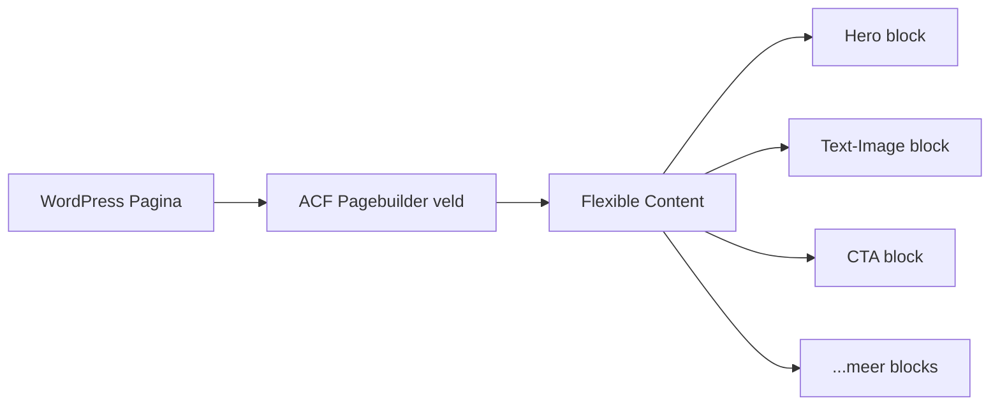

## Overzicht

Elke pagina wordt opgebouwd met een **ACF Flexible Content** veld genaamd `pagebuilder`. Dit veld bevat layouts (blocks) die de redacteur in willekeurige volgorde kan toevoegen en herschikken.



---

## Hoe het werkt

<Steps>
  <Step title="Redacteur voegt blocks toe" icon="plus">
    In de WordPress editor kiest de redacteur blocks uit het Flexible Content veld. Elk block heeft eigen invoervelden (tekst, afbeeldingen, buttons, etc.).
  </Step>
  <Step title="Loop.php laadt de blocks" icon="code">
    `templates/pagebuilder/loop.php` loopt door alle gekozen layouts en laadt het bijbehorende PHP-template:

    ```php
    <?php if ( have_rows('pagebuilder') ) : ?>
        <?php while ( have_rows('pagebuilder') ) : the_row(); ?>
            <?php
            $layout = get_row_layout();
            $template = get_template_directory() . "/templates/pagebuilder/{$layout}/{$layout}.php";
            if ( file_exists( $template ) ) {
                include $template;
            }
            ?>
        <?php endwhile; ?>
    <?php endif; ?>
    ```
  </Step>
  <Step title="Block template rendert HTML" icon="layout">
    Elk block heeft een eigen PHP-template dat de ACF velden uitleest en HTML genereert met Tailwind CSS classes.
  </Step>
</Steps>

---

## Block Structuur

Elk pagebuilder block bestaat uit **3 bestanden** in een eigen map:

```
templates/pagebuilder/<block-slug>/
├── <block-slug>.php      # PHP template (markup + ACF velden)
├── <block-slug>.css      # Block-specifieke styles
└── <block-slug>.js       # Block-specifieke JavaScript (kan leeg zijn)
```

Optioneel: `thumbnail.jpg` voor preview in de ACF admin.

---

## Nieuw Block Aanmaken

<Steps>
  <Step title="Maak de block-map aan" icon="folder">
    ```bash
    mkdir templates/pagebuilder/mijn-block
    ```

    Naamgeving: **lowercase met hyphens** (bijv. `text-image`, `call-to-action`, `veelgestelde-vragen`).
  </Step>
  <Step title="Maak PHP template" icon="code">
    `templates/pagebuilder/mijn-block/mijn-block.php`:

    ```php
    <?php
    /**
     * Pagebuilder Block: Mijn Block
     */
    defined('ABSPATH') || exit;

    // UI opties
    $padding_top    = get_sub_field('padding_top') ?: 'py-16';
    $padding_bottom = get_sub_field('padding_bottom') ?: 'pb-16';
    $bg_color       = get_sub_field('bg_color') ?: 'bg-white';

    // Content velden
    $title   = get_sub_field('title');
    $content = get_sub_field('content');
    ?>

    <section class="mijn-block <?php echo esc_attr("$padding_top $padding_bottom $bg_color"); ?>">
        <div class="container mx-auto px-4">
            <?php if ($title) : ?>
                <h2 class="font-title text-3xl md:text-5xl font-bold mb-6">
                    <?php echo wp_kses_post($title); ?>
                </h2>
            <?php endif; ?>

            <?php if ($content) : ?>
                <div class="prose max-w-none">
                    <?php echo wp_kses_post($content); ?>
                </div>
            <?php endif; ?>

            <?php kj_render_buttons(); ?>
        </div>
    </section>
    ```

    **Belangrijke regels:**
    - Gebruik `get_sub_field()` (niet `get_field()`)
    - Escape output: `wp_kses_post()`, `esc_html()`, `esc_url()`
    - Gebruik Tailwind classes direct in de template
  </Step>
  <Step title="Maak CSS bestand" icon="palette">
    `templates/pagebuilder/mijn-block/mijn-block.css`:

    ```css
    /* Mijn Block — alleen custom CSS die niet met Tailwind kan */
    .mijn-block {
        /* Voeg alleen CSS toe als Tailwind niet volstaat */
    }
    ```

    **CSS regels:**
    - Gebruik Tailwind classes in PHP, **niet** custom CSS
    - **Geen media queries** — gebruik Tailwind responsive classes (`md:`, `lg:`)
    - Dit bestand mag leeg zijn als alles met Tailwind kan
  </Step>
  <Step title="Maak JS bestand" icon="terminal">
    `templates/pagebuilder/mijn-block/mijn-block.js`:

    ```javascript
    (function() {
        'use strict';

        const blocks = document.querySelectorAll('.mijn-block');
        if (!blocks.length) return;

        // Block-specifieke JavaScript hier
    })();
    ```

    Wrap altijd in een IIFE met `'use strict'`.
  </Step>
  <Step title="Maak ACF veldgroep" icon="database">
    Maak `acf-json/group_layout_mijn-block.json` met de invoervelden.

    Essentieel:
    - `"active": false` (wordt gecloned in pagebuilder)
    - `"acfe_autosync": ["json"]` voor JSON sync
    - Update `"modified"` timestamp: `date +%s`
    - Image velden: `"return_format": "array"` + `"preview_size": "thumbnail"`
    - Buttons: altijd als repeater
  </Step>
  <Step title="Registreer in pagebuilder" icon="plus">
    Voeg een layout entry toe aan `acf-json/group_pagebuilder.json`:

    ```json
    {
        "key": "layout_mijn-block",
        "name": "mijn-block",
        "label": "Mijn Block",
        "display": "block",
        "sub_fields": [
            {
                "key": "field_clone_mijn-block",
                "type": "clone",
                "clone": ["group_layout_mijn-block"],
                "display": "seamless",
                "layout": "all"
            }
        ]
    }
    ```

    Update de `"modified"` timestamp.
  </Step>
  <Step title="Importeer CSS en registreer JS" icon="link">
    **CSS** — Voeg toe aan `assets/css/input.css`:
    ```css
    @import '../../templates/pagebuilder/mijn-block/mijn-block.css';
    ```

    **JS** — Voeg block naam toe aan de array in `scripts/build-pagebuilder-js.js`.

    Draai daarna:
    ```bash
    npm run build
    ```
  </Step>
</Steps>

---

## Block Overzicht per Project

<Tabs>
  <Tab title="Veel gebruikt" icon="star">
    Blocks die in bijna elk project voorkomen:

    | Block | Beschrijving |
    |-------|-------------|
    | `hero` | Hero sectie met titel, subtitel, buttons, achtergrondafbeelding |
    | `text-image` | Tekst naast afbeelding (links/rechts wisselbaar) |
    | `call-to-action` | CTA sectie met achtergrondkleur en buttons |
    | `reviews` | Klantbeoordelingen (slider of grid) |
    | `veelgestelde-vragen` | FAQ accordion |
    | `proces` | Stappenplan / proces uitleg |
    | `projecten-cases` | Projecten showcase (uit CPT) |
  </Tab>
  <Tab title="Specialistisch" icon="layers">
    Blocks die project-specifiek zijn:

    | Block | Project | Beschrijving |
    |-------|---------|-------------|
    | `kennisbank` | Asbestverwijdering | Kennisbank artikelen overzicht |
    | `team` | Asbestverwijdering, Ecoxbouw | Teamleden grid |
    | `podcasts` | Vullings Media | Podcast afleveringen |
    | `pricing` / `tarieven` | VDBrand | Prijstabellen |
    | `diensten` | Ecoxbouw, Vullings | Services grid |
    | `cijfers` | Ecoxbouw, Vullings | Statistieken/nummers |
    | `marquee` | Ecoxbouw | Scrollende tekst/logos |
  </Tab>
</Tabs>

---

## UI Opties (Witruimte & Achtergrond)

De meeste blocks hebben standaard UI-opties onder een "Witruimte" tab in ACF:

| Veld | Type | Opties | Beschrijving |
|------|------|--------|-------------|
| `padding_top` | Select | `py-8` t/m `py-32` | Bovenmarge van de sectie |
| `padding_bottom` | Select | `pb-8` t/m `pb-32` | Ondermarge van de sectie |
| `bg_color` | Select | `bg-white`, `bg-grey-light`, etc. | Achtergrondkleur |

<Callout kind="tip" title="Tabs regel">
  Als een block tabs gebruikt in ACF, moeten **alle** velden onder een tab staan. Start altijd met een "Content" tab, gevolgd door een "Witruimte" of "UI Opties" tab.
</Callout>
