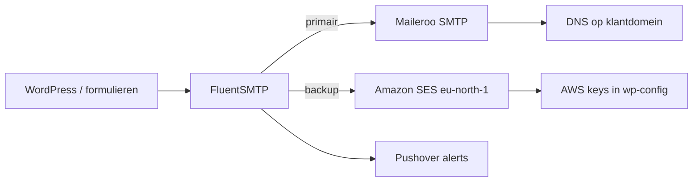

**FluentSMTP** is de standaard WordPress-plugin voor transactionele mail. Server-mail (`mail()`) gebruiken we niet.

<Callout kind="info" title="Geen export">
  FluentSMTP heeft geen nette settings-export. Credentials horen in **`wp-config.php` via xCloud** (niet in de database, niet in Git). Documenteer per project alleen providers + from-adressen.
</Callout>

## Standaardopzet (twee connections)

| # | Rol | Provider | From |
|---|-----|----------|------|
| **1** | Primair | **Maileroo** (SMTP) | `noreply@klantdomein.nl` |
| **2** | Backup | **Amazon SES** | `klantnaam@kayjilesen.dev` |

In FluentSMTP: **SMTP verzender** = connection 1, **verzender 2 / backup** = connection 2.

- Logging: **1 jaar** bewaren  
- Beide connections + Pushover **testen** na setup  



---

## 1. Primair — Maileroo (`noreply@klant`)

Op het **zelfde klantdomein**. Voeg eerst de DNS-records toe die Maileroo voorschrijft (SPF/DKIM e.d.) op het klantdomein.

| Veld | Waarde |
|------|--------|
| Van e-mail | `noreply@klantdomein.nl` |
| Van naam | Merk-/bedrijfsnaam klant |
| Provider | Other SMTP / Maileroo |
| SMTP host | `smtp.maileroo.com` |
| SMTP poort | `587` |
| Encryptie | TLS (poort 587; SSL op 465 indien nodig) |
| Auto TLS | Aan (tenzij de server problemen geeft) |
| Authenticatie | Aan |
| Toegangssleutels | **In configuratiebestand** (niet in DB) |

In `wp-config.php` (via xCloud):

```php
define( 'FLUENTMAIL_SMTP_USERNAME', 'YOUR_MAILEROO_USERNAME' );
define( 'FLUENTMAIL_SMTP_PASSWORD', 'YOUR_MAILEROO_PASSWORD' );
```

---

## 2. Backup — Amazon SES (`@kayjilesen.dev`)

| Veld | Waarde |
|------|--------|
| Van e-mail | `klantnaam@kayjilesen.dev` (of vaste conventie per project) |
| Provider | Amazon SES |
| Regio | **Europa (Stockholm)** — `eu-north-1` |
| Toegangssleutels | **In configuratiebestand** (niet in DB) |

In de AWS-portal: Access Key + Secret aanmaken (IAM met SES-send rechten) en in `wp-config.php` zetten:

```php
define( 'FLUENTMAIL_AWS_ACCESS_KEY_ID', 'YOUR_AWS_ACCESS_KEY_ID' );
define( 'FLUENTMAIL_AWS_SECRET_ACCESS_KEY', 'YOUR_AWS_SECRET_ACCESS_KEY' );
```

<Callout kind="warning">
  Zet nooit echte keys in Git of in deze docs. Alleen via xCloud → `wp-config.php` / environment.
</Callout>

---

## 3. Credentials via xCloud

1. Open de site in xCloud  
2. Bewerk `wp-config.php` (of de constants die xCloud daar injecteert)  
3. Plak de `define()`-regels voor Maileroo **en** SES  
4. In FluentSMTP bij beide connections: **Toegangssleutels in configuratiebestand** kiezen (niet “opslaan in DB”)

---

## 4. Pushover-waarschuwingen

Via FluentSMTP → **Waarschuwingen** / notifications:

1. Maak in **Pushover** een applicatie aan (favicon/logo van het project of KJ)  
2. Koppel API-token/user key in FluentSMTP  
3. Stuur een testalert zodat mislukte mail zichtbaar is op je telefoon  

---

## Checklist nieuwe site

<Steps>
  <Step title="DNS Maileroo" icon="globe">
    Records van Maileroo op het klantdomein zetten; wacht op propagatie.
  </Step>
  <Step title="Connection 1 — Maileroo" icon="mail">
    `noreply@klant.nl` + host `smtp.maileroo.com:587` TLS; keys via `FLUENTMAIL_SMTP_*` in wp-config.
  </Step>
  <Step title="Connection 2 — Amazon SES" icon="cloud">
    `…@kayjilesen.dev`, regio Stockholm; keys via `FLUENTMAIL_AWS_*` in wp-config.
  </Step>
  <Step title="Routing" icon="git-branch">
    Primair = Maileroo, backup = SES. Logging 1 jaar.
  </Step>
  <Step title="Pushover" icon="bell">
    Waarschuwingen koppelen; testnotificatie sturen.
  </Step>
  <Step title="Testen" icon="check-circle">
    Testmail via connection 1 én 2. Check inbox/spam en Pushover bij een geforceerde fout indien mogelijk.
  </Step>
</Steps>

## Troubleshooting

| Probleem | Check |
|----------|--------|
| Maileroo faalt | DNS (SPF/DKIM) op klantdomein; username/password defines; poort 587 TLS |
| SES faalt | Regio = Stockholm; IAM rechten; from-adres/`kayjilesen.dev` geverifieerd in SES |
| Keys niet gelezen | FluentSMTP staat op “configuratiebestand”; defines vóór `require wp-settings.php` |
| Geen Pushover | App-token/user key; test vanuit Waarschuwingen |

## Gerelateerd

- [Plugins Overzicht](/wordpress/plugins/overzicht)
- [Microsoft 365](/email/microsoft-365) — mailboxen voor mensen (niet per se transactioneel)
- [Google Workspace](/email/google-workspace)
- [MXRoute](/email/mxroute)
- [Site Management](/hosting/site-management)
