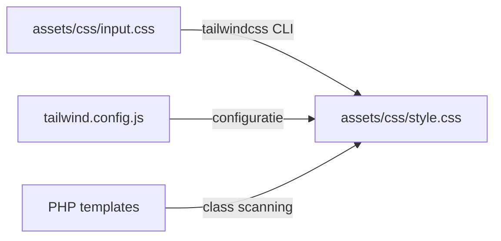

## Overzicht

Alle projecten gebruiken **Tailwind CSS v3.4** als CSS framework. Tailwind wordt via de CLI gecompileerd — geen PostCSS config nodig.

---

## Build Flow



| Bestand | Rol |
|---------|-----|
| `assets/css/input.css` | Bronbestand met Tailwind directives + imports |
| `assets/css/style.css` | Gecompileerde output (gegenereerd, niet bewerken) |
| `tailwind.config.js` | Kleuren, fonts, spacing, content paths |

---

## NPM Scripts

```bash
# Development — watch mode (auto-hercompilatie)
npm run dev

# Productie — geminificeerde output
npm run build:css
```

| Script | Commando | Wanneer |
|--------|----------|---------|
| `dev` | `tailwindcss -i input.css -o style.css --watch` | Tijdens ontwikkeling |
| `build:css` | `tailwindcss -i input.css -o style.css --minify` | Voor commit/deploy |

<Callout kind="tip" title="Altijd dev draaien">
  Start elke ontwikkelsessie met `npm run dev`. Wijzigingen in PHP templates worden automatisch opgepikt door Tailwind.
</Callout>

---

## tailwind.config.js

### Content Paths

Tailwind scant deze bestanden voor class names:

```javascript
content: [
    "./inc/*.php",
    "./templates/**/*.php",
    "./templates/*.php",
    "./*.php"
],
```

Alle PHP bestanden in het thema worden gescand. Tailwind genereert alleen CSS voor classes die daadwerkelijk gebruikt worden.

### Custom Tokens

Per project worden kleuren, fonts en eventuele spacing/radius tokens geconfigureerd:

```javascript
theme: {
    extend: {
        colors: {
            'primary': '#FFD500',
            'secondary': '#1A1603',
            // ... project-specifiek
        },
        fontFamily: {
            'sans': ['Karla', 'system-ui', 'sans-serif'],
            'title': ['TGS', 'system-ui', 'sans-serif'],
        },
    },
},
```

---

## Kleuren per Project

| Project | Primary | Secondary | Accent(s) |
|---------|---------|-----------|-----------|
| Perfect Finish | `#FFD500` (yellow) | `#1A1603` (dark) | grey varianten |
| Asbestverwijdering | `#FFD500` (yellow) | `#1A1603` (dark) | `#004E64` (blue) |
| ecoXbouw | `#216b45` (green) | `#8bb4a2` (sage) | `#ccbe54` (gold) |
| KJ-Boilerplate | `#F35613` (orange) | `#035F5A` (teal) | `#032A28` (dark) |
| VDBrand | `#1DB19B` (teal) | `#147D6D` (dark teal) | `#ff9c00` (orange) |
| Vullings Media | `#DDDD47` (yellow) | — | — |

---

## Fonts per Project

| Project | Sans/Body | Titles | Extra |
|---------|-----------|--------|-------|
| Perfect Finish | Karla | TGS | — |
| Asbestverwijdering | Karla | TGS | — |
| ecoXbouw | Lexend | Funnel Display | — |
| VDBrand | Open Sans | Montserrat | — |
| Vullings Media | Figtree | Anton | Azeret Mono (mono) |

Fonts worden geladen via `@font-face` declaraties in `assets/css/input.css`.

---

## CSS Regels

<Tabs>
  <Tab title="Tailwind eerst" icon="star">
    **Gebruik altijd Tailwind classes in PHP templates. Custom CSS alleen als het echt niet anders kan.**

    ```php
    <!-- Goed: Tailwind classes in template -->
    <div class="flex items-center gap-4 p-6 md:p-8 bg-primary rounded-lg">
        <h2 class="font-title text-3xl md:text-5xl font-bold">Titel</h2>
    </div>
    ```

    ```css
    /* Fout: CSS schrijven voor wat Tailwind kan */
    .element {
        display: flex;
        align-items: center;
        gap: 1rem;
        padding: 1.5rem;
    }
    ```
  </Tab>
  <Tab title="Geen media queries" icon="smartphone">
    **Geen `@media` queries in CSS bestanden. Gebruik Tailwind responsive classes.**

    ```php
    <!-- Goed: responsive met Tailwind -->
    <div class="p-4 md:p-6 lg:p-8">
    <h1 class="text-2xl md:text-4xl lg:text-6xl">

    <!-- Fout: media query in CSS -->
    ```

    ```css
    /* FOUT — nooit doen */
    @media (min-width: 768px) {
        .element { padding: 1.5rem; }
    }
    ```

    Voor pseudo-elementen waar Tailwind niet werkt: gebruik `clamp()`.

    ```css
    /* Goed: clamp() voor responsive pseudo-element */
    .element::before {
        height: clamp(0.75rem, 1vw, 1rem);
    }
    ```
  </Tab>
  <Tab title="Geen hex codes" icon="palette">
    **Gebruik Tailwind kleurnamen, nooit hex/rgb codes in templates.**

    ```php
    <!-- Goed -->
    <div class="bg-primary text-secondary">

    <!-- Fout -->
    <div class="bg-[#FFD500] text-[#1A1603]">
    <div style="background-color: #FFD500;">
    ```
  </Tab>
</Tabs>

---

## input.css Structuur

```css
/* Tailwind directives */
@tailwind base;
@tailwind components;
@tailwind utilities;

/* Globale componenten */
@import './header.css';
@import './footer.css';

/* Pagebuilder blocks */
@import '../../templates/pagebuilder/hero/hero.css';
@import '../../templates/pagebuilder/text-image/text-image.css';
@import '../../templates/pagebuilder/call-to-action/call-to-action.css';
/* ... alle blocks */

/* Font-face declaraties */
@font-face {
    font-family: 'TGS';
    src: url('../fonts/TGS.woff2') format('woff2');
    font-weight: normal;
    font-style: normal;
    font-display: swap;
}
```

**Importvolgorde:**
1. Tailwind directives
2. Globale component CSS
3. Block CSS imports
4. `@font-face` declaraties

---

## Plugins

Sommige projecten gebruiken Tailwind plugins:

| Plugin | Project | Doel |
|--------|---------|------|
| `@tailwindcss/typography` | Asbestverwijdering | Prose styling voor kennisbank/blog content |

```javascript
// tailwind.config.js
plugins: [
    require('@tailwindcss/typography'),
],
```

---

## Cache Busting

CSS wordt in WordPress ge-enqueued met `filemtime()` voor automatische cache busting:

```php
wp_enqueue_style(
    'theme-style',
    get_template_directory_uri() . '/assets/css/style.css',
    [],
    filemtime(get_template_directory() . '/assets/css/style.css')
);
```

Bij elke build verandert de bestandstijd, waardoor browsers automatisch de nieuwe versie laden.
